# cypress-schema-validator

A Cypress plugin for API schema validation. It leverages the core-ajv-schema-validator powered by the AJV package (for plain JSON schemas, Swagger documents, and OpenAPI schemas) as well as the core-zod-schema-validator powered by the ZOD package (for Zod schemas).

> 🚀🚀🚀 **IMPORTANT NOTE: This plugin `cypress-schema-validator` replaces the previously existing `cypress-ajv-schema-validator`, maintaining complete backward compatibility while extending the API to support Zod schema validation capabilities.** 

 


## MAIN FEATURES

✔️ Cypress command **`cy.validateSchema()`** (and alias **`cy.validateSchemaAjv()`**) performs a JSON Schema Validation and reports errors in the responses of network requests made with `cy.request()`.
   - Schemas are provided as JSON objects, which can come from a Cypress fixture.
   - Supports **Plain JSON schemas**, **OpenAPI 3.x schema documents** and **Swagger 2.0 schema documents**.
   - Utilizes the **core-ajv-schema-validator**, leveraging the **Ajv JSON Schema Validator** .

✔️ Cypress command **`cy.validateSchemaZod()`** identifies and reports Zod schema validation errors in the responses of network requests made with `cy.request()`.
   - Schemas are provided as **Zod objects**, which can come from a Cypress fixture.
   - Uses the **core-zod-schema-validator** , leveraging the **Zod Schema Validator**.
  
✔️ The commands are chainable with `cy.request()` and yield the original API response.

✔️ Provides a summary of schema errors as well as a list of individual validation errors directly in the Cypress log.
  
✔️ By clicking on the schema errors summary in the Cypress log, the DevTools console outputs:
   -  Total number of schema errors.
   -  Full list of schema errors as provided by **Ajv** or **Zod** depending on the selected command.
   -  A nested tree view of the validated data, clearly indicating the errors and where they occurred in an easy-to-understand format.

✔️ Presents results to the user in a consistent format, regardless of whether the AJV Schema Validator or ZOD Validator is used.

✔️ Output the schema errors in the terminal when executing in `run` mode.

✔️ Allow custom styles (icons and text colors) to match the user's preferences for distinguishing schema errors.

✔️ Environment variable **`disableSchemaValidation`** to disable schema validation in your tests.

✔️ Fully integrates with **Gleb Bahmutov**'s [@bahmutov/cy-api](https://github.com/bahmutov/cy-api) and **Filip Hric**'s [cypress-plugin-api](https://github.com/filiphric/cypress-plugin-api) plugins, allowing JSON schema validations to be performed immediately after the `cy.api()` command.
   - With the environment variable **`enableMismatchesOnUI`** enabled, schema errors are displayed directly in the user interface of these plugins for enhanced visibility.

> ⭐⭐⭐⭐⭐ Example usage with **@bahmutov/cy-api** and **cypress-plugin-api** plugins:
> 
> `cy.api('/users/1').validateSchema(schema);`
>
> For detailed examples of `cypress-schema-validator` used with the `@bahmutov/cy-api` and `cypress-plugin-api` plugins in the Swagger Petstore API, refer to the sample test files: [test-petstore-with-cypress-plugin-api.js](cypress/e2e/test-petstore-with-cypress-plugin-api.js) and [test-multiple-api.js](cypress/e2e/test-multiple-api.js).

&nbsp; 

- [cypress-schema-validator](#cypress-schema-validator)
  - [MAIN FEATURES](#main-features)
  - [COMPATIBILITY](#compatibility)
  - [INSTALLATION](#installation)
  - [CONFIGURATION](#configuration)
  - [ABOUT JSON SCHEMAS AND SCHEMA VALIDATORS](#about-json-schemas-and-schema-validators)
    - [JSON Schema](#json-schema)
    - [OpenAPI 3.x and Swagger 2.0 Schema Documents](#openapi-3x-and-swagger-20-schema-documents)
    - [Ajv JSON Schema Validator](#ajv-json-schema-validator)
    - [Zod Schema Validator](#zod-schema-validator)
  - [API REFERENCE](#api-reference)
    - [`cy.validateSchema(schema[, path[, issuesStyles]])` (and alias `cy.validateSchemaAjv(schema[, path[, issuesStyles]])`)](#cyvalidateschemaschema-path-issuesstyles-and-alias-cyvalidateschemaajvschema-path-issuesstyles)
      - [Parameters](#parameters)
      - [Returns](#returns)
      - [Throws](#throws)
      - [Path Parameter](#path-parameter)
    - [`cy.validateSchemaZod(schema[, issuesStyles])`](#cyvalidateschemazodschema-issuesstyles)
      - [Parameters](#parameters-1)
      - [Returns](#returns-1)
      - [Throws](#throws-1)
  - [USAGE EXAMPLES](#usage-examples)
    - [Examples For AJV Schema Validation USAGE-EXAMPLES-AJV.md.](#examples-for-ajv-schema-validation-usage-examples-ajvmd)
    - [Examples For ZOD Schema Validation USAGE-EXAMPLES-ZOD.md.](#examples-for-zod-schema-validation-usage-examples-zodmd)
  - [SCHEMA VALIDATION RESULTS](#schema-validation-results)
    - [Results Outcome (Passed/Failed)](#results-outcome-passedfailed)
      - [Test Passed ✔️](#test-passed-️)
      - [Test Failed ❌](#test-failed-)
        - [Detailed Error View in the Console](#detailed-error-view-in-the-console)
        - [Test Failed with More than 10 Errors ➕](#test-failed-with-more-than-10-errors-)
        - [Schema errors in the Terminal when executing in `run` mode](#schema-errors-in-the-terminal-when-executing-in-run-mode)
    - [Integration with other Cypress API Plugins](#integration-with-other-cypress-api-plugins)
      - [Integration with Gleb Bahmutov's `@bahmutov/cy-api` Plugin](#integration-with-gleb-bahmutovs-bahmutovcy-api-plugin)
      - [Integration with Filip Hric's `cypress-plugin-api`](#integration-with-filip-hrics-cypress-plugin-api)
    - [Custom Styles for Validation Errors](#custom-styles-for-validation-errors)
    - [Results for AJV Schema Validation vs ZOD Schema Validation](#results-for-ajv-schema-validation-vs-zod-schema-validation)
  - [DISABLE JSON SCHEMA VALIDATION IN YOUR TESTS](#disable-json-schema-validation-in-your-tests)
  - [LICENSE](#license)
  - [CONTRIBUTING](#contributing)
  - [CHANGELOG](#changelog)
    - [\[1.0.0\]](#100)
    - [\[cypress-ajv-schema-validator 2.0.1\]](#cypress-ajv-schema-validator-201)
  - [EXTERNAL REFERENCES](#external-references)
    - [For cypress-ajv-schema-validator (predecessor plugin)](#for-cypress-ajv-schema-validator-predecessor-plugin)

&nbsp; 

## COMPATIBILITY

- Cypress 12.0.0 or higher
- Ajv 8.16.0 or higher
- ajv-formats 3.0.1 or higher
  
For Typescript projects also:
- TypeScript 4.5+
- You must enable strict mode in your `tsconfig.json`. This is a best practice for all TypeScript projects.


##  INSTALLATION 

```sh
npm install -D cypress-schema-validator
```

## CONFIGURATION

- Add the following lines either to your `cypress/support/commands.js` to include the custom command and function globally, or directly in the test file that will host the schema validation tests:

  ```js
  import 'cypress-schema-validator';
  ```

- To **disable schema validation** even when the `cy.validateSchema()` command is present in the test, set the Cypress environment variable **`disableSchemaValidation`** to **`true`**. By default, schema validation is enabled.

- To **enable the display of schema errors** directly in the user interfaces of the `@bahmutov/cy-api` and `cypress-plugin-api` plugins, set the Cypress environment variable **`enableMismatchesOnUI`** to **`true`**. By default, this feature is disabled.

&nbsp; 

## ABOUT JSON SCHEMAS AND SCHEMA VALIDATORS

### JSON Schema

JSON Schema is a hierarchical, declarative language that describes and validates JSON data.

### OpenAPI 3.x and Swagger 2.0 Schema Documents

The OpenAPI Specification (formerly Swagger Specification) are schema documents to describe your entire API (in JSON format or XML format). So a schema document will contain multiple schemas, one for each supported combination of **_Endpoint - Method - Expected Response Status_** (also called _path_) by that API.

### Ajv JSON Schema Validator

AJV, or Another JSON Schema Validator, is a JavaScript library that validates data objects against a JSON Schema structure.

It was chosen as the core engine of the `core-ajv-schema-validator` plugin because of its versatility, speed, capabilities, continuous maintenance, and excellent documentation. For more information on Ajv, visit the [Ajv official website](https://ajv.js.org/).

Ajv supports validation of the following schema formats: **JSON Schema**, **OpenAPI 3.x** specification, and **Swagger 2.0** specification. However, Ajv needs to be provided with the specific schema to be validated for an endpoint, method, and expected response; it cannot process a full OpenAPI 3.x or Swagger 2.0 schema document by itself.

The `cypress-schema-validator` plugin simplifies this by obtaining the correct schema definition for the endpoint you want to test. You just need to provide the full schema document (OpenAPI or Swagger) and the path to the schema definition of the service you want to validate for your API (_Endpoint - Method - Expected Response Status_).

> **Note:** The Ajv instance used in this plugin (`cypress-schema-validator`) is configured with the options `{ allErrors: true, strict: false }` to display all validation errors and disable strict mode.

### Zod Schema Validator

Zod is a TypeScript-first schema declaration and validation library that allows defining schemas directly in TypeScript while providing robust type detection within your code.

It was chosen as the core engine of the `core-zod-schema-validator` plugin due to its developer-friendly nature, versatility, and seamless integration into modern TypeScript workflows. Its intuitive API, extensive validation capabilities, and active maintenance make it a powerful tool for schema validation. For more information on Zod, visit the [Zod official website](https://zod.dev/).

The `cypress-schema-validator` plugin integrates Zod by enabling developers to supply Zod schemas directly for validation. You define the schema for the service and endpoint you want to validate, and the plugin ensures that the API responses adhere to the specified structure.

&nbsp; 

## API REFERENCE

&nbsp; 

### `cy.validateSchema(schema[, path[, issuesStyles]])` (and alias `cy.validateSchemaAjv(schema[, path[, issuesStyles]])`)

It validates the JSON data in the response body against the provided **Plain JSON schema**, **OpenAPI** and **Swagger** document format using the **AJV Schema Validator**.
It is expected to be chained to an API response (from a `cy.request()` or `cy.api()`).

#### Parameters

- **`schema`** (object)
  The schema to validate against. Supported formats are plain JSON schema, Swagger, and OpenAPI documents.
- **`path`** (object, optional)
  This second parameter represents the path to the schema definition in a Swagger or OpenAPI document and is determined by three properties:
  - **`endpoint`** (string, optional): The endpoint path.
  - **`method`** (string, optional): The HTTP method. Defaults to 'GET'.
  - **`status`** (integer, optional): The response status code. If not provided, defaults to 200.
- **`issuesStyles`** (object, optional)
   An object with the icons and HEX colors used to flag the issues. If not provided, it will use the default icons defined in the plugin.
   Includes the following properties:
  - **`iconPropertyError`** (string, optional): The icon used to flag type errors in the data. Support emojis.
  - **`iconPropertyMissing`** (string, optional): The icon used to flag type errors in the data. Support emojis.
  - **`colorPropertyError`** (string, optional): The HEX color used to flag the property error.
  - **`colorPropertyMissing`** (string, optional): The HEX color used to flag the missing property.
 
#### Returns

- `Cypress.Chainable`: The response object wrapped in a `Cypress.Chainable`.

#### Throws

- `Error`: If any of the required parameters are missing or if the schema or schema definition is not found.

&nbsp; 

Example providing a **_Plain JSON schema_**:

```js
cy.request('GET', 'https://awesome.api.com/users/1')
  .validateSchema(schema);
```
or
```js
cy.request('GET', 'https://awesome.api.com/users/1')
  .validateSchemaAjv(schema);
```

Example providing a **_Plain JSON schema and custom `issuesStyles`_**:

```js
const issuesStylesOverride = {
  iconPropertyError: '🟦', colorPropertyError: '#5178eb',
  iconPropertyMissing: '🟪', colorPropertyMissing: '#800080'
}
cy.request('GET', 'https://awesome.api.com/users/1')
  .validateSchema(schema, undefined, issuesStylesOverride);
```
or
```js
const issuesStylesOverride = {
  iconPropertyError: '🟦', colorPropertyError: '#5178eb',
  iconPropertyMissing: '🟪', colorPropertyMissing: '#800080'
}
cy.request('GET', 'https://awesome.api.com/users/1')
  .validateSchemaAjv(schema, undefined, issuesStylesOverride);
```

Example providing an **_OpenAPI 3.0.1 or Swagger 2.0 schema documents and path to the schema definition_**:

```js
cy.request('GET', 'https://awesome.api.com/users/1')
  .validateSchema(schema, { endpoint: '/users/{id}', method: 'GET', status: 200 });
```
or
```js
cy.request('GET', 'https://awesome.api.com/users/1')
  .validateSchemaAjv(schema, { endpoint: '/users/{id}', method: 'GET', status: 200 });
```

Example providing an **_OpenAPI 3.0.1 or Swagger 2.0 schema documents, path to the schema definition and custom `issuesStyles`_**:

```js
const issuesStylesOverride = {
  iconPropertyError: '🟦', colorPropertyError: '#5178eb',
  iconPropertyMissing: '🟪', colorPropertyMissing: '#800080'
}
cy.request('GET', 'https://awesome.api.com/users/1')
  .validateSchema(schema, { endpoint: '/users/{id}', method: 'GET', status: 200 }, issuesStylesOverride);
```
or
```js
const issuesStylesOverride = {
  iconPropertyError: '🟦', colorPropertyError: '#5178eb',
  iconPropertyMissing: '🟪', colorPropertyMissing: '#800080'
}
cy.request('GET', 'https://awesome.api.com/users/1')
  .validateSchemaAjv(schema, { endpoint: '/users/{id}', method: 'GET', status: 200 }, issuesStylesOverride);
```

#### Path Parameter

Using the path defined by `{ endpoint, method, status }`, the plugin will automatically take the schema `$ref` for that definition, find it in the `components` section, and use it in the schema validation.

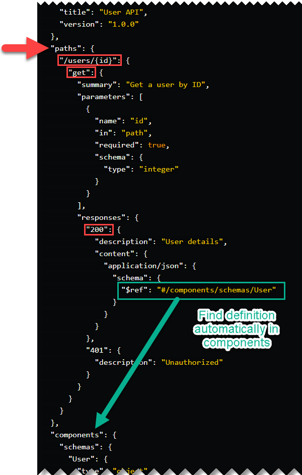 

&nbsp; 

### `cy.validateSchemaZod(schema[, issuesStyles])`

It validates the JSON data in the response body against the provided **Zod schema** using the **ZOD Schema Validator**.
It is expected to be chained to an API response (from a `cy.request()` or `cy.api()`).

#### Parameters

- **`schema`** (object)
   The schema to validate against. Supported format is Zod Schema.
- **`issuesStyles`** (object, optional)
   An object with the icons used to flag the schema issues. If not provided, it will use the default icons defined in the plugin `core-zod-schema-validator`.
   Includes the following properties:
  - **`iconPropertyError`** (string, optional): The icon used to flag type errors in the data. Support emojis.
  - **`iconPropertyMissing`** (string, optional): The icon used to flag type errors in the data. Support emojis.
  - **`colorPropertyError`** (string, optional): The HEX color used to flag the property error.
  - **`colorPropertyMissing`** (string, optional): The HEX color used to flag the missing property.

#### Returns

- `Cypress.Chainable`: The response object wrapped in a `Cypress.Chainable`.

#### Throws

- `Error`: If any of the required parameters are missing or if the schema or schema definition is not found.

&nbsp; 

Example providing a **_Zod schema_**:

```js
cy.request('GET', 'https://awesome.api.com/users/1')
  .validateSchemaZod(schema);
```

Example providing a **_Zod schema nd custom `issuesStyles`_**:

```js
const issuesStylesOverride = {
  iconPropertyError: '🟦', colorPropertyError: '#5178eb',
  iconPropertyMissing: '🟪', colorPropertyMissing: '#800080'
}
cy.request('GET', 'https://awesome.api.com/users/1')
  .validateSchemaZod(schema, issuesStylesOverride);
```

&nbsp; 

## USAGE EXAMPLES

### Examples For AJV Schema Validation [USAGE-EXAMPLES-AJV.md](USAGE-EXAMPLES-AJV.md).

Includes detailed examples for the use cases:

  - `.validateSchema()` command with a **Plain JSON schema**.

  - `.validateSchema()` command with a **Plain JSON schema** and overriding `issuesStyles`
  
  - `.validateSchema()` command with an **OpenAPI 3.0.1 schema** document.
  
  - `.validateSchemaAjv()` command with a **Swagger 2.0 schema** document.

  - `.validateSchema()` command with a **Swagger 2.0 schema** document and overriding `issuesStyles`.
  
  - `.validateSchemaAjv()` command in conjunction with **`cy.api()` from the `@bahmutov/cy-api` or `cypress-plugin-api` plugins**.

### Examples For ZOD Schema Validation [USAGE-EXAMPLES-ZOD.md](USAGE-EXAMPLES-ZOD.md).

Includes detailed examples for the use cases:

  - `.validateSchemaZod()` command with a **Zod Schema**.

  - `.validateSchemaZod()` command with a **Zod Schema** and overriding `issuesStyles`.
  
  - `.validateSchemaAZod()` command with **`cy.api()` from Plugin `@bahmutov/cy-api` or `cypress-plugin-api` plugins**.


## SCHEMA VALIDATION RESULTS

### Results Outcome (Passed/Failed)

Here are some screenshots of schema validation tests run in Cypress for the different test results.

#### Test Passed ✔️

When a test passes, the Cypress log will show the message: "✔️ **PASSED - THE RESPONSE BODY IS VALID AGAINST THE SCHEMA.**".

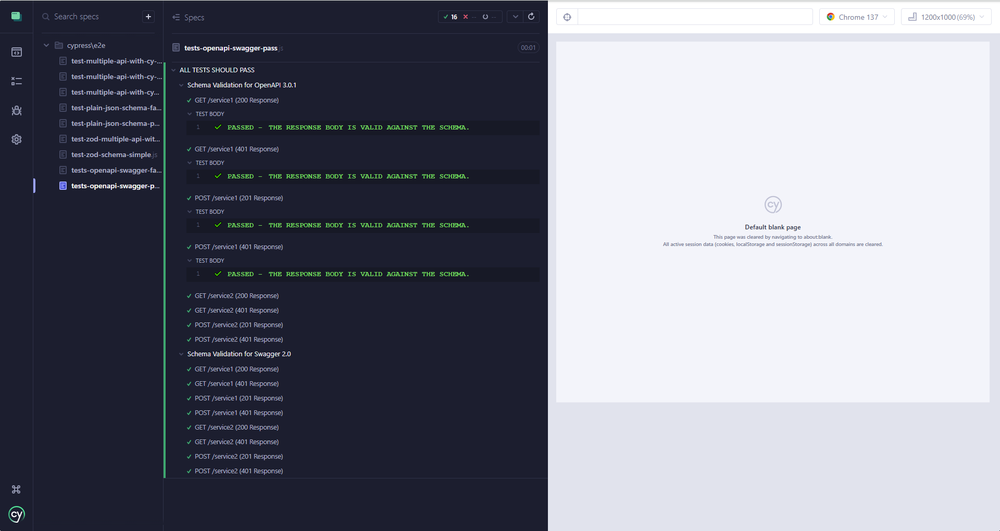 

#### Test Failed ❌

When a test fails, the Cypress log will show the message: "❌ **FAILED - THE RESPONSE BODY IS NOT VALID AGAINST THE SCHEMA**"; indicating the total number of errors: _(Number of schema errors: N_).

Also, the Cypress log will show an entry for each of the individual schema validation errors as provided by AJV or ZOD. The errors that correspond to missing fields in the data validated are marked with the symbol ❌, and the rest of the errors like with the symbol ⚠️.

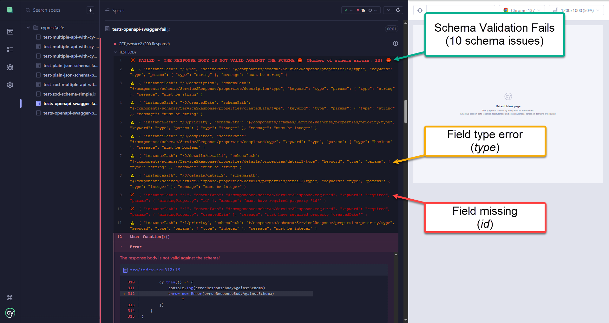 

##### Detailed Error View in the Console

If you open the Console in the browser DevTools, and click on the summary line for the schema validation error in the Cypress log, the console will display detailed information about all the errors. This includes:

- Message containing the schema analysis results.
- The total number of errors.
- Complete list of errors provided by the core Schema Validator (AJV or ZOD).
- A user-friendly view of the mismatches between the validated data and the JSON schema, highlighting where each validation error occurred and the exact reason for the mismatch.

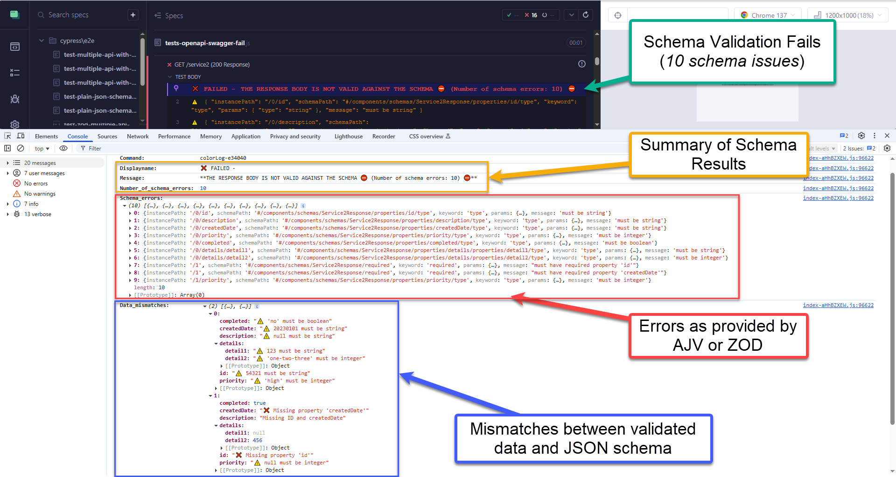 

##### Test Failed with More than 10 Errors ➕

When there are more than 10 schema validation errors, the Cypress log will show only the first 10 and, at the end of the list, an additional line indicating "**...and _N_ more errors.**".

If you click on the "**...and N more errors.**" line in the Cypress log, the browser console will show additional details for the errors grouped under that entry as provided by the core Schema Validator (AJV or ZOD).

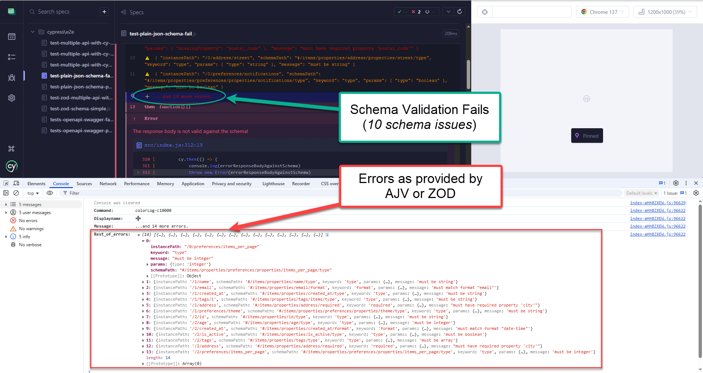 


##### Schema errors in the Terminal when executing in `run` mode

In case the tests are executed in run mode and there are schema errors, these will be displayed in the Terminal as provided by the AJV or ZOD validators.

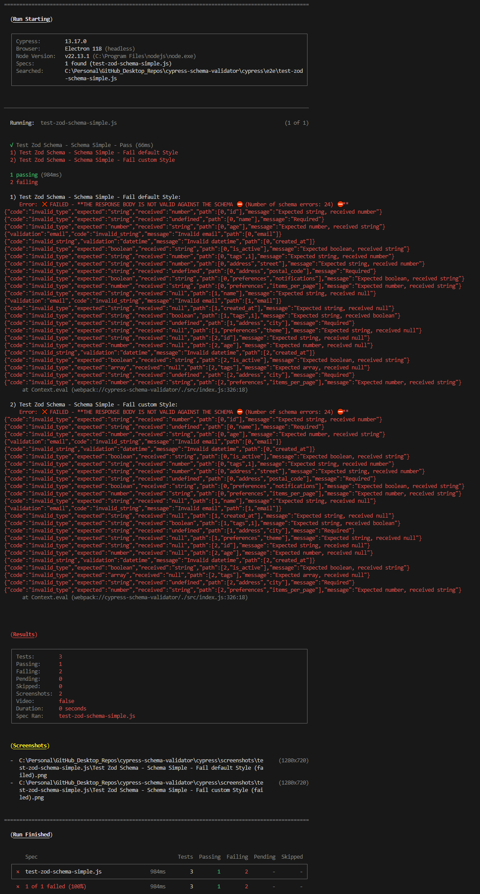 


### Integration with other Cypress API Plugins

#### Integration with Gleb Bahmutov's `@bahmutov/cy-api` Plugin

When the Cypress environment variable **`enableMismatchesOnUI`** is set to **`true`**, and you have imported the `@bahmutov/cy-api` plugin into your `cypress/support/commands.js` or test file, schema validation mismatches will be displayed directly in the plugin's UI in a user-friendly format.

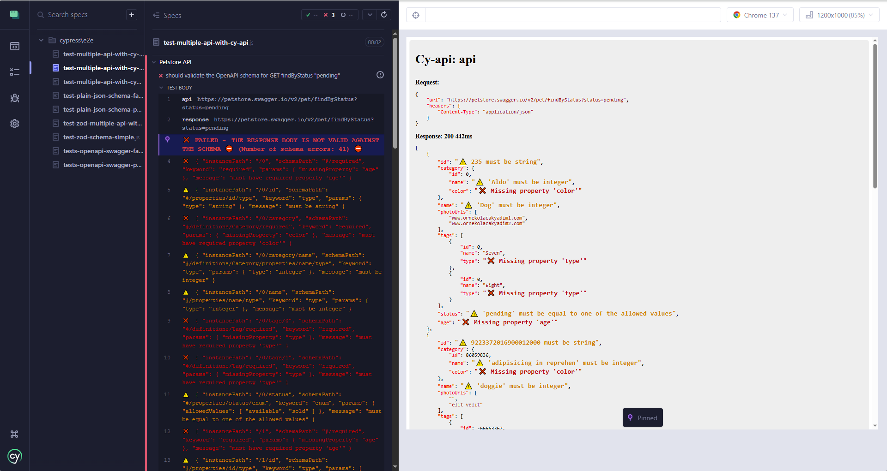 

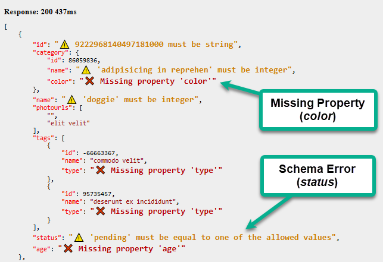 

#### Integration with Filip Hric's `cypress-plugin-api`

Similarly, when the Cypress environment variable **`enableMismatchesOnUI`** is set to **`true`**, and the `cypress-plugin-api` plugin is imported into your `cypress/support/commands.js` or test file, schema violations will be shown in the plugin's UI.

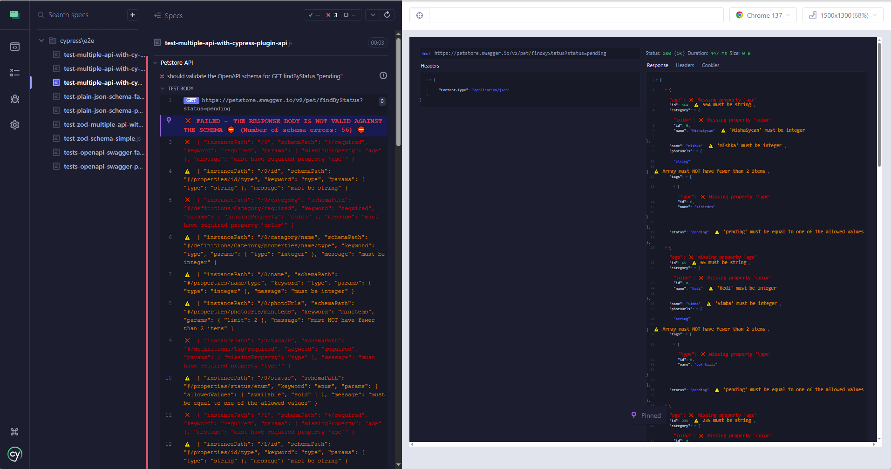 

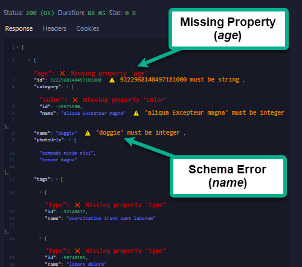 


### Custom Styles for Validation Errors

The **Custom Styles for Validation Errors** feature allows users to personalize the display of schema validation issues for enhanced clarity. By specifying custom styles through the issuesStyles object, users can customize icons and HEX color codes to flag specific validation errors visually.

These customizable styles ensure flexibility and improved error identification suited to individual preferences.

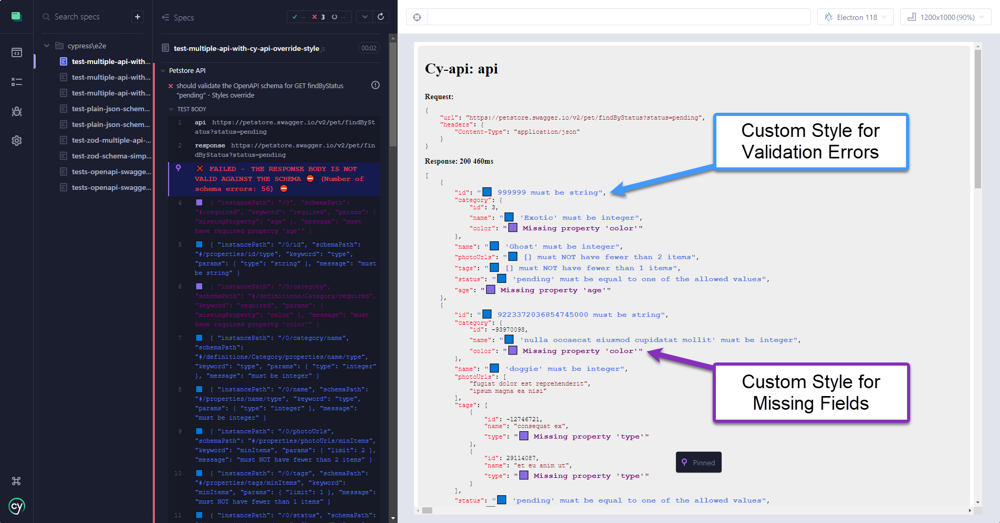


### Results for AJV Schema Validation vs ZOD Schema Validation

One of the significant advantages of using this plugin is that it presents results to the user in a consistent format, regardless of whether the AJV Schema Validator or ZOD Validator is used. This ensures that if the plugin's user decides to switch between validators, the results remain uniform and consistent.

This provides a layer of abstraction that manages how the results are presented, allowing the user to focus solely on the results themselves.

If we compare the results presented by the cypress-schema-plugin for AJV validation and ZOD validation side by side, we can observe that the data mismatch results displayed in the Cypress UI, as well as the nested tree view of the validated data, remain consistent. This ensures an identical user experience when identifying schema issues.

The only slight differences are the schema error properties presented in the Cypress Log and the console, as these are provided by the specific validator. This allows users to inspect the results in the original validator format, if they are more familiar with it.

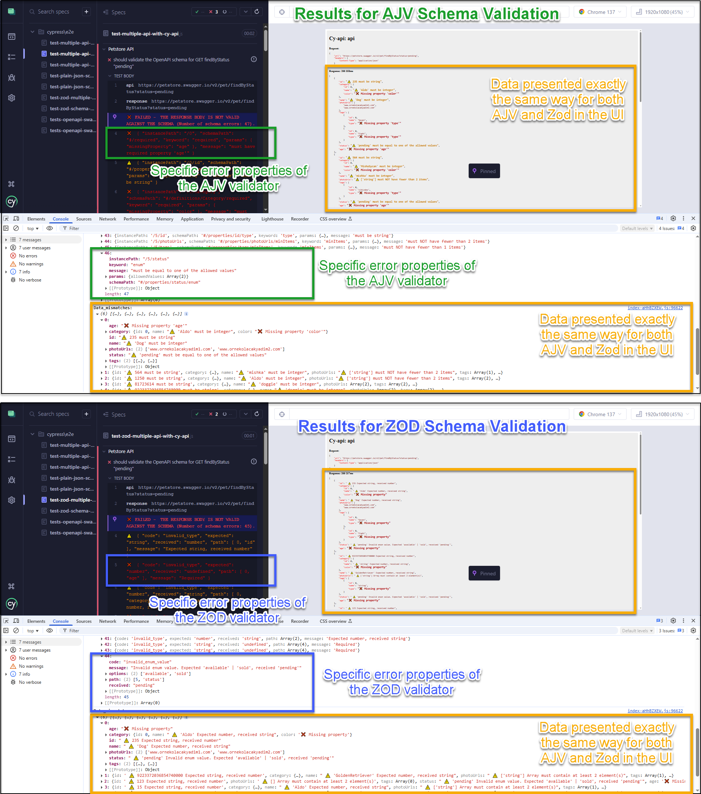 

&nbsp; 

## DISABLE JSON SCHEMA VALIDATION IN YOUR TESTS

You can disable schema validation in your tests by setting the Cypress environment variable **`disableSchemaValidation`** to **`true`**.

The environment variable can be set in various locations, depending on the specific contexts in which you want to disable the functionality.
- **Cypress Configuration File (`cypress.config.js`)**: This is useful for applying settings globally across all tests.
- **Cypress Environment File `(cypress.env.json)`**: Use this for setting environment variables to be accessible during specific test runs.
- **Command Line Interface (CLI) using `--env`**: This is ideal for temporary overrides during specific test executions without affecting other configurations.
- **Within Test Configuration**: Set it directly in the test file for precise control over individual test behaviors.

When schema validation is disabled for a test, the Cypress log and the browser console will display the following message:

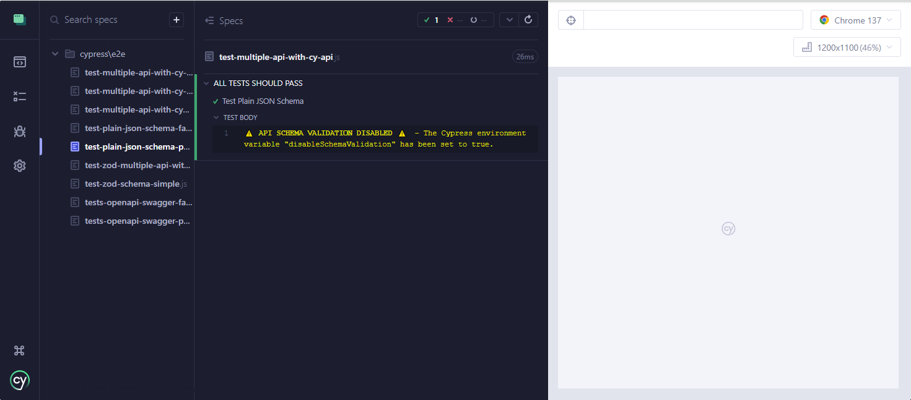 

&nbsp; 

## LICENSE

This project is licensed under the MIT License. See the [LICENSE](LICENSE) file for more details.


## CONTRIBUTING

First off, thanks for taking the time to contribute!

To contribute, please follow the best practices promoted by GitHub on the [Contributing to a project](https://docs.github.com/en/get-started/exploring-projects-on-github/contributing-to-a-project "Contributing to a project") page.

And if you like the project but just don't have the time to contribute, that's fine. There are other easy ways to support the project and show your appreciation, which we would also be very happy about:
- Star the project
- Promote it on social media
- Refer this project in your project's readme
- Mention the project at local meetups and tell your friends/colleagues
- Buying me a coffee or contributing to a training session, so I can keep learning and sharing cool stuff with all of you.

<a href="https://www.buymeacoffee.com/sclavijosuero" target="_blank"></a>

Thank you for your support!


## CHANGELOG

### [1.0.0]
- Initial release of `cypress-schema-validator`, supporting both AJV and ZOD schema validations.

### [cypress-ajv-schema-validator 2.0.1]
- Predecessor to the `cypress-schema-validator`


## EXTERNAL REFERENCES

### For cypress-ajv-schema-validator (predecessor plugin)

- [json-schema.org](https://json-schema.org/ "https://json-schema.org/") - Website [JSON Schema Tooling](https://json-schema.org/tools?query=&sortBy=name&sortOrder=ascending&groupBy=toolingTypes&licenses=&languages=&drafts=&toolingTypes=#json-schema-tooling "JSON Schema Tooling")

- [cypress.io](https://www.cypress.io/ "https://www.cypress.io/") - Blog [Elevate Your Cypress Testing: Top 10 Essential Plugins](https://www.cypress.io/blog/elevate-your-cypress-testing-top-10-essential-plugins "Elevate Your Cypress Testing: Top 10 Essential Plugins")

- [Murat Ozcan](https://www.linkedin.com/in/murat-ozcan-3489898/ "Murat Ozcan")
    - Video [Schema validation using cypress-ajv-schema-validator vs Optic](https://www.youtube.com/watch?v=ysCADOh9aJU "Schema validation using cypress-ajv-schema-validator vs Optic")
    - Video [Demo comparing API e2e vs Schema testing](https://www.youtube.com/watch?v=ePjcKMq4c2o "Demo comparing API e2e vs Schema testing")
    - Course [Epic Test Arch. - test everything, everywhere all at once](https://www.udemy.com/course/epic-test-arch-test-everything-everywhere-all-at-once/?referralCode=97449422709A69966E4B "Epic Test Arch. - test everything, everywhere all at once")

- [Joan Esquivel Montero](https://www.linkedin.com/in/joanesquivel/ " Joan Esquivel Montero") - Video [Cypress API Testing: AJV SCHEMA VALIDATOR](https://www.youtube.com/watch?v=SPmJvH5mYaU "Cypress API Testing: AJV SCHEMA VALIDATOR")
